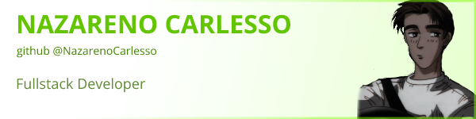

# 👋🏻 Hey! Nice to see you

### Welcome to my page!

<ul>
  <li> 👋🼠Hi, I'm Nazareno, Fullstack developer from  <b> Córdoba, Argentina </b>
  <li> 🧉 I'm currently learning English and TypeScript
  <li> 🏊🏼‍♂️ I love swimming and going to the gym
  <li> 🐱‍👤 Take a look and feel free to contact me
</ul>

### 👨🏻‍💻 Things I code with

  
  
  
  
  
  

### 🤖 Things I like to use

  
  
  
  
    
  
  

### 🌎 Contact

